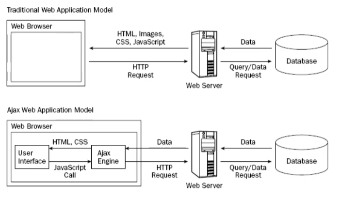

# AJAX
Asynchronous JavaScript & XML
 
(A día de hoy el XML ha sido sustituido por JSON)
 

 
AJAX es un motor que trabaja de intermediario entre la parte del navegador web y el servidor, es decir, es la pasarela entre el front y el back.
 
 

## Métodos nativos de AJAX
* ActiveXObject (IES explorer) - Derogado!
* XMLHttpRequest
* [API Fetch](https://developer.mozilla.org/en-US/docs/Web/API/Fetch_API)

## Librerías externas
* JQuery.ajax()
* Axios
* Etc

## Estados de la petición
* READY_STATE_UNINITIALIZED = 0
* READY_STATE_LOADING = 1
* READY_STATE_LOADED = 2
* READY_STATE_INTERACTIVE = 3
* READY_STATE_COMPLETE = 4

## Códigos de estado de respuesta HTTP
1. Respuestas informativas (100 - 199)
2. Respuestas satisfactorias (200 - 299)
3. Redirecciones (300 - 399)
4. Errores de los clientes (400 - 499)
5. Errores de los servidores (500 - 599)
* [HTTP response status codes - MDN](https://developer.mozilla.org/en-US/docs/Web/HTTP/Status)

 
